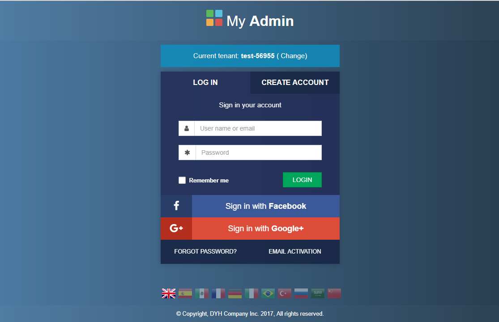
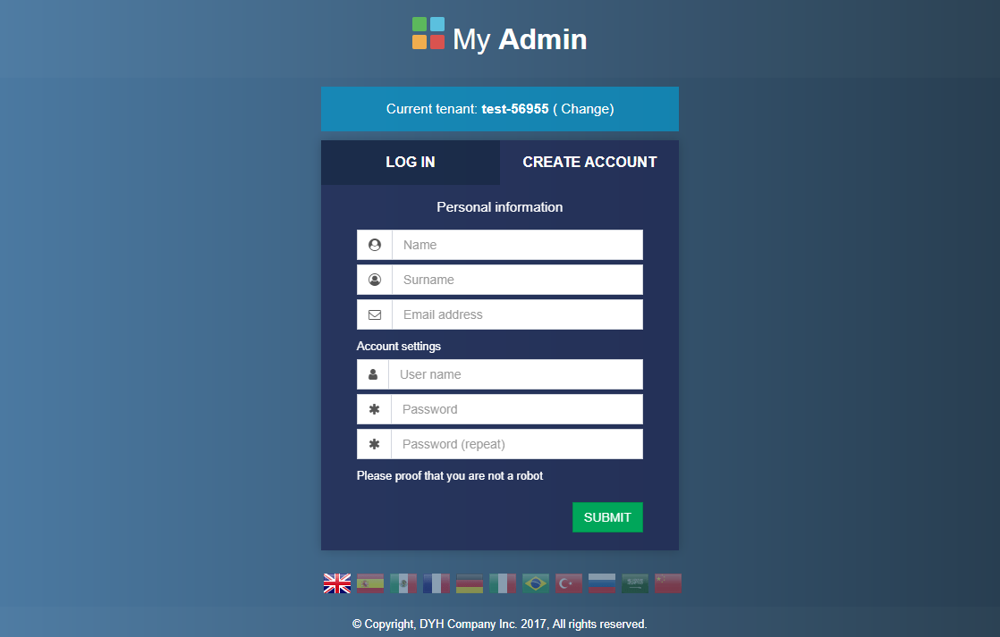
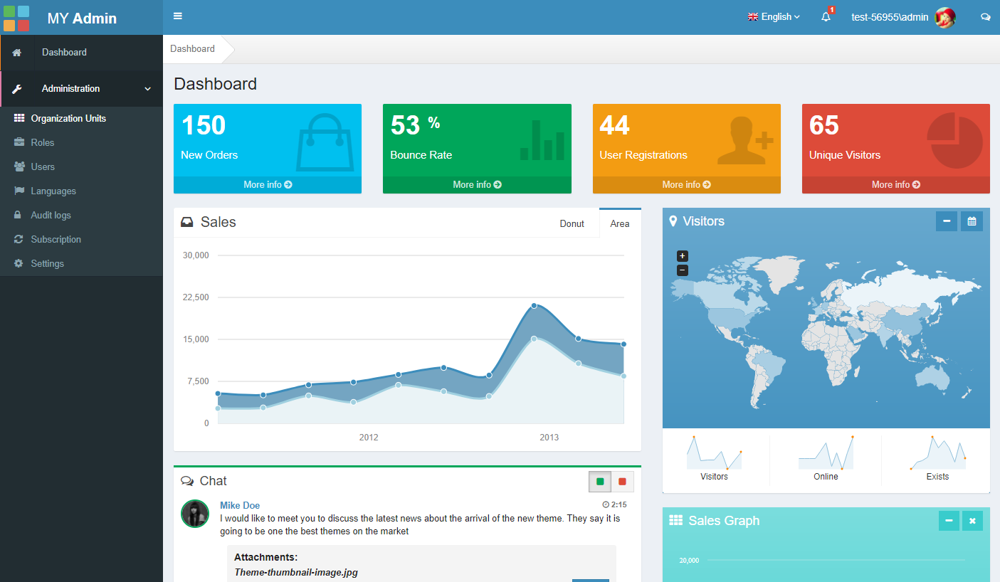
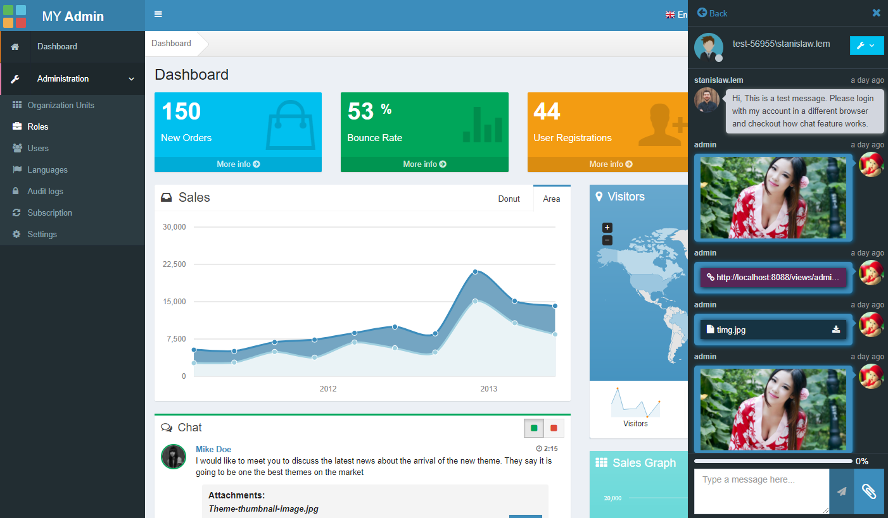
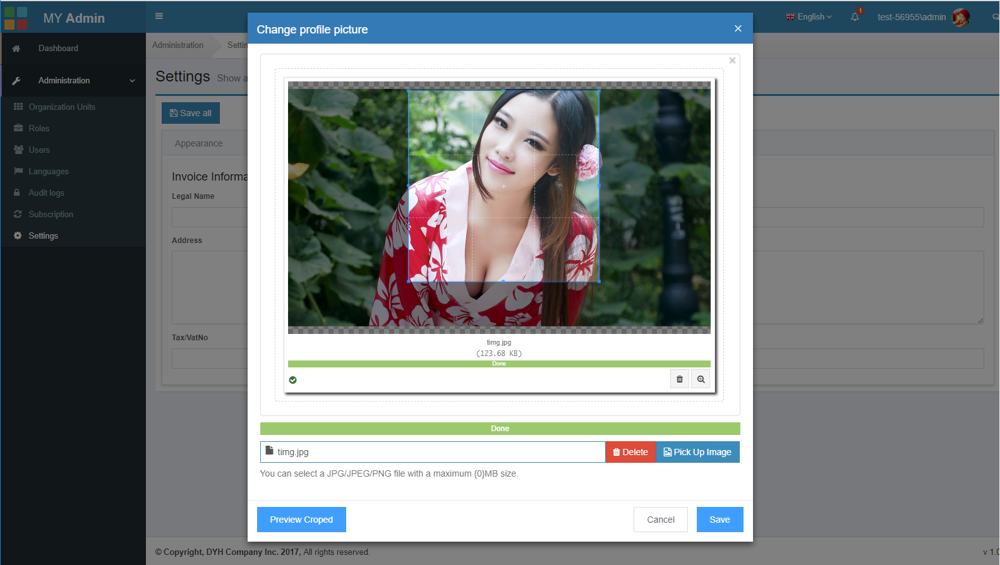
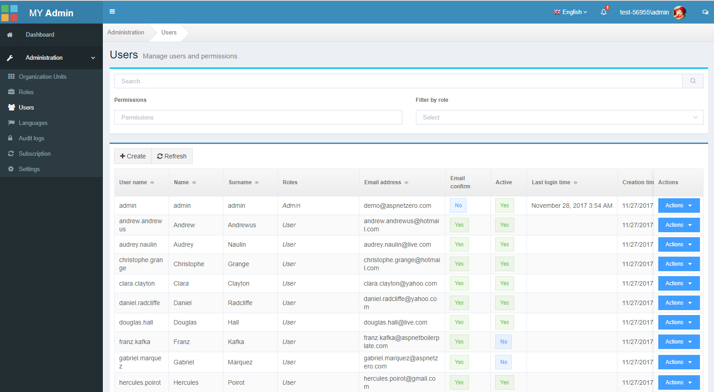

# DYH

> 为了学习使用VUE，断断续续在一个多月里使用 Webpack + Vue + Vuex + Vue-Router + axios + ElementUI 以及 AdminLTE 前端模板， 重构了一下 AbpZero 前端。该项目没有任何服务器端脚本，是一个纯粹的客户端项目。代码当中可能有错误，也有可能对某些特性或者对Vue以及Vue下的一些扩展不当使用，如有发现，请您务必在issue里面指正留言，我会一一回复，您的指正和建议是我学习改进的动力。

## 坏境

> NodeJS 6.11.3

> NPM 3.10.10

> 安装过程可能会碰到 node-sass 无法安装的情况，请使用cnpm安装。如何使用cnpm请自行度娘。

## 配置

配置类在 src/common/config.js, 您可以使用土牛的远程webapi，当前配置的就是土牛的webapi地址。如果您有服务端代码，您可自行配置为本地webapi。

> 用户名: admin 

> 密码: 123456

该项目是个学习类项目，基本是按照原有的功能实现的。除了第三方登录功能没实现外，当然有可能没有些我没发现的功能木有实现

```javascript
/**
 *  配置入口类
 *
 * @class Config
 */
class Config {
    constructor() {
        // 从 webpack中配置的调式模式
        this.isDebug = process && process.isDebug;
        this.AccessTokenKey = 'Abp.AuthToken';
        this.EncryptedAccessTokenKey = 'enc_auth_token';
        this.TwoFactorRememberClientTokenKey = 'TwoFactorRememberClientToken';
        // 远程webpai 访问地址
        // this.remoteUrl = 'http://localhost:5000';
        this.remoteUrl = 'http://test-56955.demo.aspnetzero.com';
        // 本地 访问地址
        this.baseUrl = 'http://localhost:8088';
        this.defaultPageSize = 10;
        this.tenancyNamePlaceHolderInUrl = '{TENANCY_NAME}';
        // this.defaultLocalizationSourceName = 'Auth';
        this.defaultLocalizationSourceName = 'AspNetZeroDemo';
        this.defaultAdminUserName = 'admin';
        // 当你模拟某个角色或者用户登录后的中转url片段
        this.signInAsSomeoneUrlSegment = 'views/transfer';
    }
}

export default new Config();
```

## Build Setup

``` bash
# install dependencies
npm install

# serve with hot reload at localhost:8080
npm run dev

# build for production with minification
npm run build

# build for production and view the bundle analyzer report
npm run build --report

# run e2e tests
npm run e2e

# run all tests
npm test
```

For a detailed explanation on how things work, check out the [guide](http://vuejs-templates.github.io/webpack/) and [docs for vue-loader](http://vuejs.github.io/vue-loader).


## 界面截图

### 登录界面



### 新建账号



### Dashboard



### Chat



### Profile



### Users

